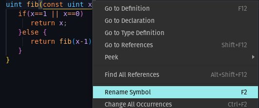
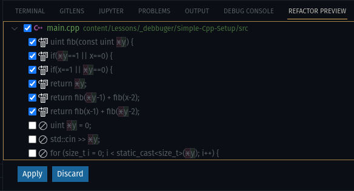
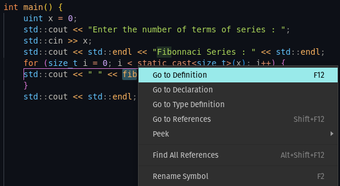
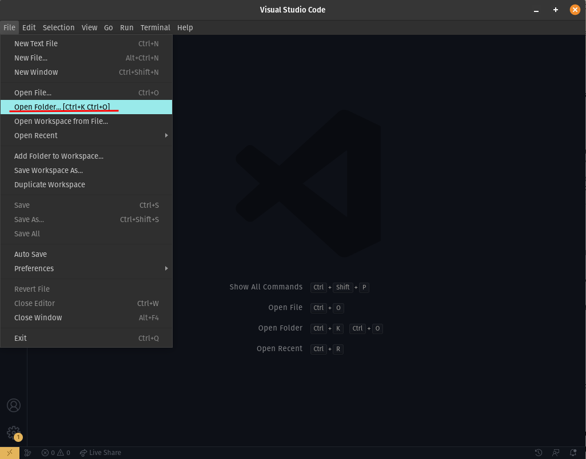
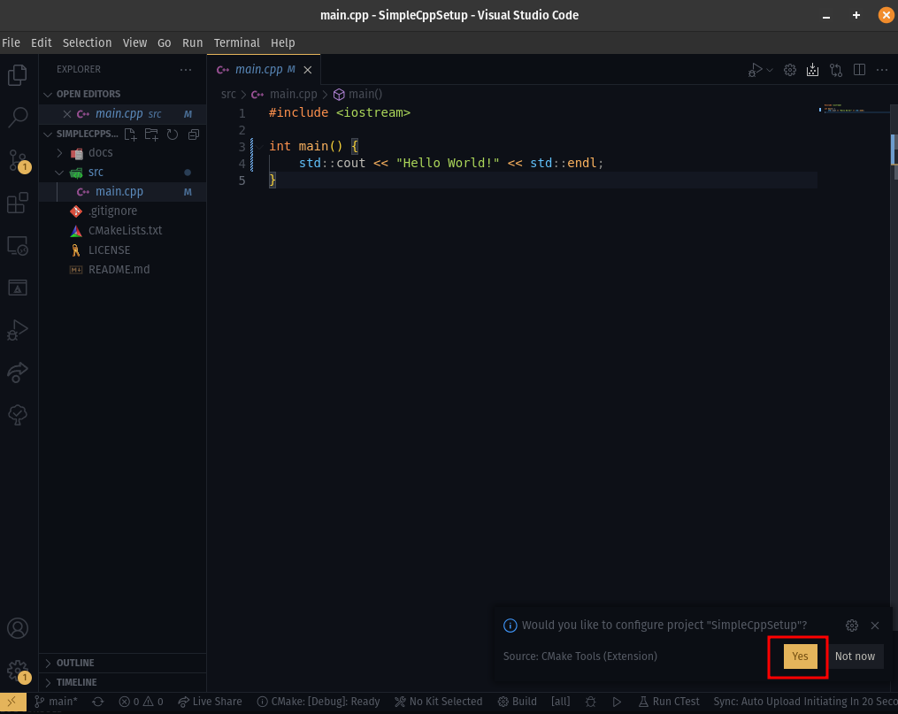
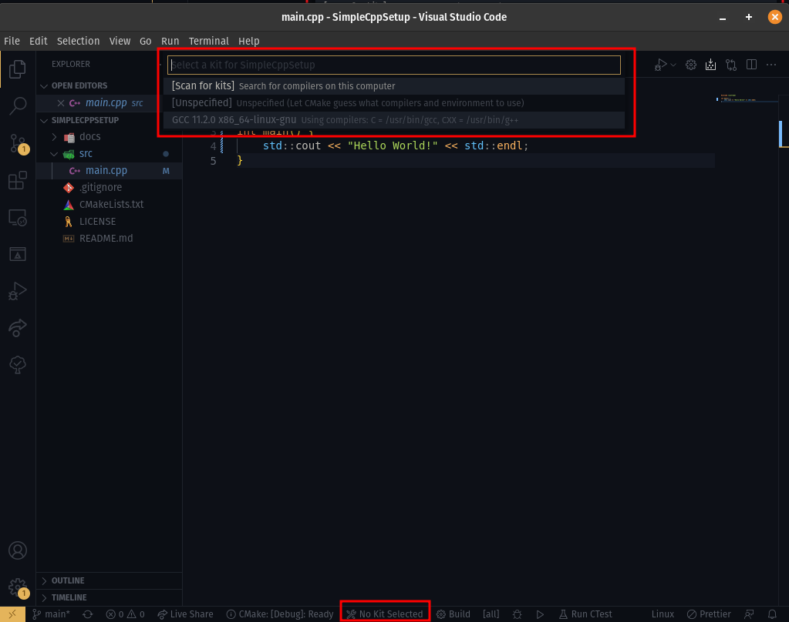

import { Chip } from "@mui/material";
import Tabs from '@theme/Tabs';
import TabItem from '@theme/TabItem';

## Introduction

Un **IDE** (Integrated Development Environment) est comme un éditeur de texte, mais beaucoup plus puissant !
Il possède de nombreuses fonctionnalités supplémentaires qui vous aideront à écrire, exécuter et déboguer votre code !

Ce cours va présenter principalement [Visual Studio Code](https://code.visualstudio.comp)(VSCode en abrégé) et je vous recommande fortement de l'utiliser pour débuter dans le monde de la programmation.
Il est versatile, compatible avec n'importe quel système d'exploitation et s'adapte, grâce à une gestion d'extensions très ingénieuse, à une multitude de langages et de cas d'utilisation.

Il existe évidemment de nombreuses alternatives et si tu sais déjà te servir de ton IDE préféré alors tu peux très bien utiliser celui de ton choix, mais j'aurais peut-être plus de difficultés pour t'aider.

# Installation

Tout d'abord il s'agit d'installer l'IDE.

Rends toi [ici](https://code.visualstudio.com/Download) et sélectionne l'installeur adapté à ton système d'exploitation.

## Les extensions

Les extensions sont, comme le nom l'indique, des modules qui permettent d'étendre les fonctionnalités de l'IDE.

Elles sont listées [ici](https://marketplace.visualstudio.com/vscode) et tu peux également les parcourir pour les installer à l'intérieur de l'IDE via le raccourci <kbd>CTRL</kbd>+<kbd>SHIFT</kbd>+<kbd>X</kbd> ou en cliquant sur cet onglet:


N'hésite pas à consulter les extensions recommandées par langage ou découvrir ce que d'autres personnes utilisent.

Concernant le C++, nous avons besoin d'installer ces extensions:
<VSCodeExtension id="ms-vscode.cpptools-extension-pack"/> 
<VSCodeExtension id="twxs.cmake"/> 

Voilà une liste non exhaustive d'autres extensions que je recommande et que j'utilise quotidiennement:
- <VSCodeExtension id="Shan.code-settings-sync"/> : Permet de sauvegarder ses réglages et les synchroniser entre plusieurs ordinateurs.
- <VSCodeExtension id="ionutvmi.path-autocomplete"/> : Fournit la complétion des chemins dans l'IDE
- <VSCodeExtension id="vscode-icons-team.vscode-icons"/> : Permet d'avoir des icônes plus jolis par type de fichier
- <VSCodeExtension id="ms-vsliveshare.vsliveshare"/> : Cela permet de travailler à distance à plusieurs dans un seul et même éditeur. C'est génial pour travailler ensemble !
- <VSCodeExtension id="wmaurer.change-case"/> : Permet de changer de format d'écriture (`case` en anglais) facilement 
- <VSCodeExtension id="Gruntfuggly.todo-tree"/> : Permet de recenser et filtrer les **TODO** d'un projet de code.
- <VSCodeExtension id="teabyii.ayu"/> : Le thème que j'utilise
- <VSCodeExtension id="eamodio.gitlens"/> : Permet de manipuler **Git** depuis l'IDE 
- <VSCodeExtension id="yzhang.markdown-all-in-one"/>  et <VSCodeExtension id="goessner.mdmath"/> : Pour l'édition de markdown
- <VSCodeExtension id="formulahendry.auto-rename-tag"/> : Permet de refermer les balises web automatiquement

... et bien d'autres encore: <VSCodeExtension id="cpylua.language-postcss"/>, <VSCodeExtension id="svelte.svelte-vscode"/>, <VSCodeExtension id="seatonjiang.gitmoji-vscode"/>, <VSCodeExtension id="ms-python.vscode-pylance"/>, <VSCodeExtension id="ms-python.python"/>, <VSCodeExtension id="rust-lang.rust-analyzer"/>, <VSCodeExtension id="tamasfe.even-better-toml"/>, <VSCodeExtension id="PolyMeilex.wgsl"/>

## Les raccourcis et actions rapides

Je vais présenter ci-dessous quelques unes des choses les plus importantes pour lesquelles un IDE peut vous aider.
Je vais les illustrer à l'aide de VSCode mais la majorité de ces fonctionnalités sont également présentes dans d'autres IDE.

### Recherche dans le fichier courant

Tu peux utiliser tout simplement la recherche dans le fichier courant en utilisant le raccourci : <kbd>CTRL</kbd>+<kbd>F</kbd>. Une popup va s'ouvrir et te laisser naviguer avec les flèches entre les occurrences.
Tu peux également faire du remplacement via la popup.


### Recherche dans un projet

Tu peux également, avec le raccourci <kbd>CTRL</kbd>+<kbd>SHIFT</kbd>+<kbd>F</kbd>, rechercher dans un projet entier.
Cela peut être très utile si tu sais comment une fonction s'appelle mais que tu ne te souviens plus dans quel fichier elle se trouve par exemple.

La barre de recherche de VSCode est géniale, tu peux même renommer les choses (pour corriger une typo) par lot ou limiter la recherche à un dossier spécifique. Cette option est disponible en cliquant sur les trois points à droite.


### Renommer par symbole

Fais un clic droit et sélectionne **"rename symbol"** ou même directement avec le raccourci <kbd>F2</kbd> sur ta sélection.



C'est mieux que de faire une simple recherche (avec <kbd>CTRL</kbd>+<kbd>F</kbd>) car ce renommage arrive à prendre en compte le contexte (les symboles) et permet de remplacer par exemple une variable nommée "Box" sans affecter une autre qui pourrait par exemple s'appeler "boundingBox".

<Tabs>

<TabItem value="1" label="Etape 1">


</TabItem>

<TabItem value="2" label="Etape 2">

Parfois une popup s'ouvre pour avoir une preview du renommage quand l'IDE n'est pas sûr à 100% de cibler les bons éléments.
Dans notre exemple, il ne s'est pas trompé mais il est possible d'adapter la sélection.


</TabItem>

<TabItem value="3" label="Etape 3">


</TabItem>

</Tabs>

### Aller à la définition

Cela te mènera directement à la définition de la variable / fonction / classe. C'est une fonctionnalité super utile pour se déplacer dans un projet.



Et si tu veux rester concentré sur la portion de code que tu es en train d'éditer, tu peux aussi regarder la définition et cela ouvrira une petite fenêtre dans ton fichier actuel.


### Aller à un symbole

Avec le raccourci <kbd>CTRL</kbd>+<kbd>SHIFT</kbd>+<kbd>O</kbd> tu peux accéder à la liste des symboles.
C'est en somme la liste des méthodes et fonctions du fichier courant.
Tu peux ensuite taper ce que tu recherches pour affiner la liste.


### Aller à un fichier

De la même manière, il est possible d'aller à un fichier sans passer par l'explorateur en utilisant le raccourci : <kbd>CTRL</kbd>+<kbd>P</kbd>.
C'est beaucoup plus rapide si tu connais le nom du fichier que tu cherches.


### Passer d'un fichier .hpp à un .cpp et inversement

Tu peux utiliser <kbd>ALT</kbd>+<kbd>O</kbd> pour passer rapidement du fichier d'en-tête au fichier d'implémentation.
Très utile lorsque tu écris du code pour une classe.

:::caution
Cette action ne fonctionne que dans le contexte d'un projet C++ et nécessite l'extension suivante <VSCodeExtension id="ms-vscode.cpptools-extension-pack"/> .
:::

---

### Aller plus loin

Si besoin, voici les liens vers les pdf de référence des raccourcis par plateforme de VSCode:

- [Windows](https://code.visualstudio.com/shortcuts/keyboard-shortcuts-windows.pdf)
- [macOS](https://code.visualstudio.com/shortcuts/keyboard-shortcuts-macos.pdf)
- [Linux](https://code.visualstudio.com/shortcuts/keyboard-shortcuts-linux.pdf)

Si tu veux aller plus loin et développer encore plus ta maîtrise de l'IDE, je t'invite à aller regarder la page <Chip label="suivante" component="a" href="Others/IDEAdvanceUse" variant="outlined" clickable/>.

## Lancer et utiliser un projet C++ avec Cmake

Maintenant que tu as un IDE fonctionnel, il est temps de coder! 

Pour commencer, tu vas pouvoir partir de ce [template](https://github.com/dsmtE/SimpleCppSetup).
C'est un projet C++ déjà configuré avec Cmake et qui va te permettre de commencer un projet sans difficulté et nous allons voir ensemble comment l'utiliser.

### Récupérer le template

Dans un premier temps, il va falloir récupérer le template, tu peux utiliser le bouton `Use this template` mis à disposition dans GIT.


:::note
Il est recommandé d'utiliser Git comme tu vas le voir dans les prochains cours mais si tu n'utilises pas GitHub mais GitLab ou même rien, télécharge simplement le code (en utilisant le menu déroulant `Code` à côté de `Utiliser ce modèle`).

Dans le cas de GitLab, tu peux créer un repo et y ajouter le code précédemment téléchargé. Le bouton `Use this template` de GitHub est juste un raccourci pratique, il n'est pas obligatoire.
:::

Tu vas ensuite cloner le repository avec la commande suivante dans le terminal de ton choix: 
```bash
git clone [url to the repository you just created]
```

Par exemple pour cloner ce repository:
```bash
git clone https://github.com/dsmtE/SimpleCppSetup
```

### Lancer le projet avec VSCode

Une fois le projet cloné, il va falloir l'ouvrir dans VSCode:



En général, l'IDE va te proposer de configurer CMake pour pouvoir lancer le projet:



En effet, la première étape est de sélectionner un kit (un compilateur utilisable par CMake).

:::note
Si tu n'as pas pu cliquer à temps, tu peux toujours sélectionner le kit en cliquant depuis la barre en bas.
:::

Si tu as bien installé un compilateur comme il faut, VSCode va le détecter et il suffit de le sélectionner. Dans le cas contraire n'hésite pas à reprendre les sections précédentes ou à me contacter.



Maintenant, tu n'as plus qu'à lancer le projet avec le bouton **start** dans la barre:


Et voir le résultat ! 


Et voilà ! Tu as lancé ton premier projet à l'aide de VSCode et Cmake ! 🎉
